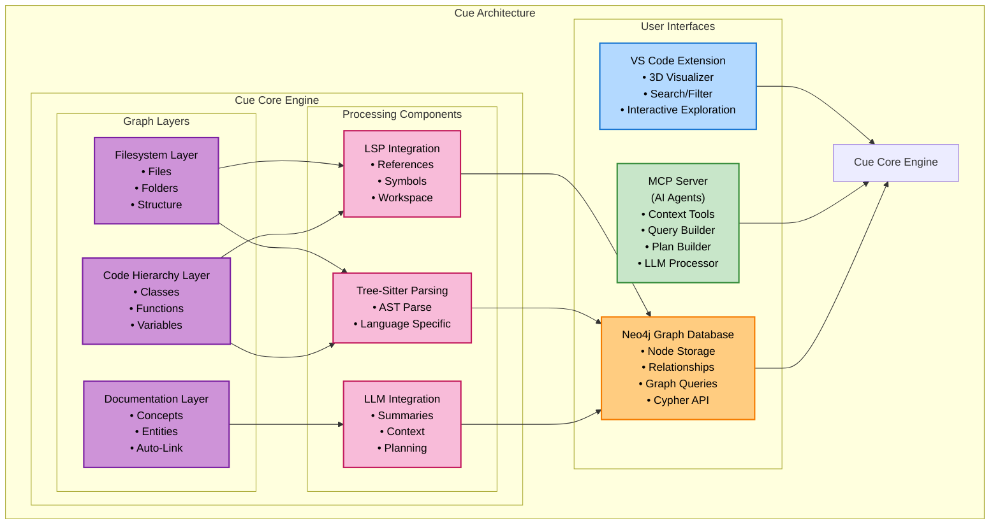

This repo introduces a method to represent a local code repository as a graph structure. The objective is to allow an LLM to traverse this graph to understand the code logic and flow. Providing the LLM with the power to debug, refactor, and optimize queries.

# Supported Languages

Blarify supports the following languages out of the box:

**Core Languages** (most popular, always included):
- Python
- JavaScript
- TypeScript
- Java
- Go

**Additional Languages** (included by default):
- Ruby
- C#
- PHP

**Note**: Blarify is designed to be robust. If a language parser is not installed or fails to load, Blarify will continue to work for other supported languages, displaying a warning for the missing language support. See [Language Support Documentation](cue/LANGUAGE_SUPPORT.md) for more details.

# Example

</img>
This graph was generated from the code in this repository.

# Architecture

Cue creates a sophisticated multilayer graph representation of your codebase:



## Components

The architecture consists of three main layers:

**User Interfaces:**
- **VS Code Extension**: Interactive 3D visualization and exploration tools
- **MCP Server**: AI agent integration for context-aware assistance
- **Neo4j Database**: Graph storage and query engine

**Graph Layers:**
- **Filesystem Layer**: Directory structure and file organization
- **Code Hierarchy Layer**: Classes, functions, and variable relationships
- **Documentation Layer**: Concept extraction and automated linking

**Processing Components:**
- **LSP Integration**: Language server protocol for semantic analysis
- **Tree-Sitter Parsing**: Abstract syntax tree generation
- **LLM Integration**: AI-powered summarization and context generation

# Quickstart

Get started with cue by following our quickstart guide:

[➡️ Quickstart Guide](https://github.com/blarApp/cue/blob/main/docs/quickstart.md)

# Article

Read our article on Medium to learn more about the motivation behind this project:

[➡️ How we built a tool to turn any codebase into a graph of its relationships](https://medium.com/@v4rgas/how-we-built-a-tool-to-turn-any-code-base-into-a-graph-of-its-relationships-23c7bd130f13)

# Features

- **Code Graph Generation**: Automatically creates a graph representation of your codebase with nodes for files, classes, functions, and their relationships
- **Multi-Language Support**: Supports Python, JavaScript, TypeScript, Ruby, Go, C#, PHP, and Java
- **LLM-Generated Descriptions** (New!): Optionally generate natural language descriptions for code elements using Azure OpenAI
- **Documentation Knowledge Graph** (New!): Parse documentation files to extract concepts, entities, and automatically link them to relevant code
- **Gitignore Integration** (New!): Automatically excludes files matching `.gitignore` patterns, with `.cueignore` for additional exclusions
- **Graph Database Integration**: Export to Neo4j or FalkorDB for visualization and querying
- **Incremental Updates**: Efficiently update the graph when code changes

# LLM Description Generation

Blarify can generate natural language descriptions for your code elements using Azure OpenAI's GPT-4. This feature helps developers quickly understand the purpose and functionality of code components. **This feature is enabled by default.**

## Setup

1. Configure Azure OpenAI credentials in your `.env` file:
```bash
AZURE_OPENAI_API_KEY=your-api-key
AZURE_OPENAI_ENDPOINT=https://your-instance.openai.azure.com/
AZURE_OPENAI_DEPLOYMENT_NAME=gpt-4
ENABLE_LLM_DESCRIPTIONS=true  # Default is true
```

2. Use the feature when building your graph:
```python
graph_builder = GraphBuilder(
    root_path="/path/to/project",
    enable_llm_descriptions=True  # Default is True
)
graph = graph_builder.build()
```

# File Exclusion and Gitignore Support

Blarify now automatically respects your `.gitignore` patterns, ensuring that version control ignored files (like `node_modules`, `.env`, build artifacts) are excluded from the graph analysis.

## How it works

- **Automatic `.gitignore` support**: All patterns in `.gitignore` files are automatically applied
- **`.cueignore` for additional exclusions**: Create a `.cueignore` file for Blarify-specific exclusions
- **Nested `.gitignore` files**: Supports `.gitignore` files in subdirectories
- **Full pattern syntax**: Supports all gitignore patterns including globs, directory markers, and comments

## Configuration

```python
# Enable gitignore support (enabled by default)
graph_builder = GraphBuilder(
    root_path="/path/to/project",
    use_gitignore=True  # Default is True
)

# Disable gitignore support if needed
graph_builder = GraphBuilder(
    root_path="/path/to/project",
    use_gitignore=False
)

# Specify custom .cueignore path
graph_builder = GraphBuilder(
    root_path="/path/to/project",
    cueignore_path="/path/to/.cueignore"
)
```

## .cueignore Example

Create a `.cueignore` file in your project root:

```
# Exclude test files
test_*.py
*_test.py

# Exclude documentation
docs/

# Exclude specific large files
data/*.csv
```

# Documentation Knowledge Graph

Blarify can parse your documentation files to create a knowledge graph of concepts, entities, and their relationships. This feature uses LLM to intelligently extract information from your docs and automatically links them to relevant code elements. **This feature is enabled by default.**

## Features

- **Automatic Documentation Detection**: Finds README, API docs, architecture docs, and other documentation files
- **Intelligent Extraction**: Uses LLM to extract concepts, entities, relationships, and code references
- **Smart Linking**: Automatically creates relationships between documentation and code nodes
- **Customizable Patterns**: Configure which documentation files to include

## Setup

1. Enable the feature when building your graph:
```python
graph_builder = GraphBuilder(
    root_path="/path/to/project",
    enable_documentation_nodes=True,  # Default is True
    documentation_patterns=["*.md", "*.rst", "*.adoc"]  # Optional custom patterns
)
graph = graph_builder.build()
```

2. The feature will create these node types:
- `DOCUMENTATION_FILE`: Represents documentation files
- `CONCEPT`: Key ideas, patterns, or methodologies mentioned in docs
- `DOCUMENTED_ENTITY`: Classes, services, or modules described in documentation

3. And these relationships:
- `CONTAINS_CONCEPT`: Links documentation files to concepts they describe
- `DESCRIBES_ENTITY`: Links documentation to entities they document
- `DOCUMENTS`: Links documentation/entities to code nodes
- `IMPLEMENTS_CONCEPT`: Links code nodes that implement documented concepts

# Future Work

- [x] Gracefully update the graph when new files are added, deleted, or modified
- [x] Add more language servers
- [x] LLM-generated descriptions for code understanding
- [x] Documentation knowledge graph with automatic code linking
- [ ] Experiment with parallelizing the language server requests
- [ ] Vector embeddings for semantic code search

# Need help?

If you need help, want to report a bug, or have a feature request, please open an issue on this repository.

You can also reach out to us at [Discord](https://discord.gg/s8pqnPt5AP)
