# Cue

> Transform any codebase into an intelligent multilayer graph for AI-powered code understanding

Cue is a sophisticated code analysis tool that creates comprehensive graph representations of codebases, enabling AI agents and developers to understand, navigate, and modify code with unprecedented precision.

## 🚀 Key Features

- **🧠 Multilayer Code Understanding Graph**: Creates interconnected layers capturing filesystem structure, code hierarchy, dependencies, and semantic relationships
- **🔍 AI-Powered Code Analysis**: Leverages LLM integration to generate natural language descriptions and extract code insights
- **📊 Interactive 3D Visualization**: VS Code extension with ThreeJS-based 3D graph visualization and real-time exploration
- **🤖 MCP Server Integration**: Model Context Protocol server for AI agents to query and analyze codebases
- **🌐 Multi-Language Support**: Supports Python, JavaScript, TypeScript, Java, Go, Ruby, C#, and PHP
- **📚 Documentation Knowledge Graph**: Automatically links documentation to code elements
- **⚡ Incremental Updates**: Efficiently updates graphs when code changes
- **🔒 Local-First**: All analysis runs locally with optional cloud LLM integration

## 🏗️ Architecture Overview

Cue creates a sophisticated multilayer graph representation of your codebase:

```mermaid
flowchart LR
    subgraph UI["User Interfaces"]
        VSCode["VS Code Extension<br/>• 3D Visualizer<br/>• Search/Filter<br/>• Interactive"]
        MCP["MCP Server<br/>(AI Agents)<br/>• Context Tools<br/>• Query Builder"]
        Neo4j["Neo4j Database<br/>• Node Storage<br/>• Graph Queries"]
    end
    
    subgraph Core["Cue Core Engine"]
        subgraph GL["Graph Layers"]
            FS["Filesystem<br/>Layer"]
            CH["Code Hierarchy<br/>Layer"]
            DOC["Documentation<br/>Layer"]
        end
        
        subgraph PC["Processing Components"]
            LSP["LSP<br/>Integration"]
            TS["Tree-Sitter<br/>Parsing"]
            LLM["LLM<br/>Integration"]
        end
    end
    
    VSCode --> Core
    MCP --> Core
    Neo4j --> Core
    
    FS --> LSP
    FS --> TS
    CH --> LSP
    CH --> TS
    DOC --> LLM
    
    LSP --> Neo4j
    TS --> Neo4j
    LLM --> Neo4j
    
    style VSCode fill:#1976d2,color:#ffffff,stroke:#0d47a1,stroke-width:2px
    style MCP fill:#388e3c,color:#ffffff,stroke:#1b5e20,stroke-width:2px
    style Neo4j fill:#f57c00,color:#ffffff,stroke:#e65100,stroke-width:2px
    style FS fill:#7b1fa2,color:#ffffff,stroke:#4a148c,stroke-width:2px
    style CH fill:#7b1fa2,color:#ffffff,stroke:#4a148c,stroke-width:2px
    style DOC fill:#7b1fa2,color:#ffffff,stroke:#4a148c,stroke-width:2px
    style LSP fill:#c2185b,color:#ffffff,stroke:#880e4f,stroke-width:2px
    style TS fill:#c2185b,color:#ffffff,stroke:#880e4f,stroke-width:2px
    style LLM fill:#c2185b,color:#ffffff,stroke:#880e4f,stroke-width:2px
```



## 🔧 Components

### Cue Core
The heart of the system that analyzes codebases and builds graph representations:

- **Language Parsing**: Tree-sitter based parsing for 8+ programming languages
- **LSP Integration**: Language Server Protocol for precise code understanding
- **Graph Builder**: Creates multilayer graph with filesystem, code hierarchy, and semantic layers
- **Incremental Updates**: Efficiently updates graphs when files change

### MCP Server
Model Context Protocol server that provides AI agents with sophisticated tools:

- **Context Retrieval**: Get comprehensive context for files or symbols
- **Change Planning**: Analyze impact and create implementation plans
- **Query Builder**: Construct efficient Neo4j Cypher queries
- **LLM Integration**: Organize results with natural language processing

### VS Code Extension
Interactive visualization and exploration interface:

- **3D Graph Visualization**: ThreeJS-based interactive 3D rendering
- **Smart Search**: Real-time search across nodes by name, type, or properties
- **Multiple Layouts**: Force-directed, hierarchical, and circular layouts
- **Neo4j Management**: Automatic Docker container management
- **Workspace Analysis**: One-click codebase analysis and ingestion

### Neo4j Integration
Graph database storage and querying:

- **Node Types**: Files, classes, functions, documentation, concepts
- **Relationships**: Dependencies, inheritance, calls, references, documentation links
- **Query Interface**: Cypher queries for complex graph traversal
- **Data Persistence**: Maintain graph state across sessions

## 📦 Installation & Setup

### Prerequisites

- **Python**: 3.10-3.14
- **Docker Desktop**: For Neo4j container management
- **VS Code**: 1.74.0+ (for extension)
- **Node.js**: 16+ (for Neo4j container manager)

### Core Installation

1. **Install Cue Core**:
   ```bash
   pip install cue
   ```

2. **Set up environment variables**:
   ```bash
   # Required for Neo4j
   export NEO4J_URI="bolt://localhost:7687"
   export NEO4J_USERNAME="neo4j"
   export NEO4J_PASSWORD="your-secure-password"
   
   # Optional: Azure OpenAI for LLM features
   export AZURE_OPENAI_API_KEY="your-api-key"
   export AZURE_OPENAI_ENDPOINT="https://your-instance.openai.azure.com/"
   export AZURE_OPENAI_DEPLOYMENT_NAME="gpt-4"
   export ENABLE_LLM_DESCRIPTIONS=true
   ```

### VS Code Extension Setup

1. **Download the extension**:
   ```bash
   # From the repository
   cd vscode-blarify-visualizer
   ```

2. **Install dependencies**:
   ```bash
   npm install
   npm run compile
   ```

3. **Package and install**:
   ```bash
   vsce package
   code --install-extension blarify-visualizer-*.vsix
   ```

4. **Configure extension settings** in VS Code:
   - Search for "Cue Visualizer" in settings
   - Add Azure OpenAI credentials (optional)
   - Configure Neo4j connection details

### MCP Server Setup

1. **Navigate to MCP server directory**:
   ```bash
   cd mcp-blarify-server
   ```

2. **Install dependencies**:
   ```bash
   pip install -r requirements.txt
   ```

3. **Configure for Claude Desktop**:
   ```json
   {
     "mcpServers": {
       "blarify": {
         "command": "python",
         "args": ["-m", "src.server"],
         "cwd": "/path/to/mcp-blarify-server",
         "env": {
           "MANAGE_NEO4J_CONTAINER": "true",
           "NEO4J_PASSWORD": "your-secure-password",
           "AZURE_OPENAI_API_KEY": "your-api-key"
         }
       }
     }
   }
   ```

## 🎯 Usage

### Basic Graph Building

```python
from cue.prebuilt.graph_builder import GraphBuilder

# Create graph builder with smart filtering
graph_builder = GraphBuilder(
    root_path="/path/to/your/project",
    use_gitignore=True,  # Respect .gitignore patterns
    enable_llm_descriptions=True,  # Generate AI summaries
    enable_documentation_nodes=True  # Parse documentation
)

# Build the graph
graph = graph_builder.build()

# Get nodes and relationships
nodes = graph.get_nodes_as_objects()
relationships = graph.get_relationships_as_objects()

print(f"Built graph with {len(nodes)} nodes and {len(relationships)} relationships")
```

### Save to Neo4j

```python
from cue.db_managers.neo4j_manager import Neo4jManager

# Save to Neo4j
graph_manager = Neo4jManager(repo_id="my-project", entity_id="main")
graph_manager.save_graph(nodes, relationships)
graph_manager.close()
```

### VS Code Extension Usage

1. **Open your project** in VS Code
2. **Analyze workspace**: Run "Cue: Analyze Workspace" command
3. **View visualization**: Run "Cue: Show 3D Visualization" command
4. **Explore the graph**:
   - Left drag: Rotate view
   - Right drag: Pan view
   - Scroll: Zoom
   - Click nodes: View details
   - Double-click: Expand neighborhood

### MCP Server with AI Agents

Use with Claude or other MCP-compatible AI agents:

```
Get context for these files using getContextForFiles:
- src/services/auth.py
- src/models/user.py

Find information about the UserService class using getContextForSymbol.

Create an implementation plan using buildPlanForChange:
"Add email verification to user registration"
```

## 🌟 Features Deep Dive

### Multilayer Graph Structure

Cue creates multiple interconnected layers:

1. **Filesystem Layer**:
   - File and directory nodes
   - Hierarchical relationships
   - Gitignore integration

2. **Code Hierarchy Layer**:
   - Classes, functions, variables
   - Inheritance and composition
   - Call graphs and dependencies

3. **Documentation Layer**:
   - Markdown and doc files
   - Extracted concepts and entities
   - Automatic code linking

4. **Semantic Layer**:
   - LLM-generated descriptions
   - Natural language summaries
   - Contextual relationships

### Language Support

**Core Languages** (always included):
- Python, JavaScript, TypeScript, Java, Go

**Additional Languages** (included by default):
- Ruby, C#, PHP

**Graceful Degradation**: Missing language parsers won't break analysis for other languages.

### Smart File Filtering

- **Gitignore Integration**: Automatically respects `.gitignore` patterns
- **Custom Exclusions**: Use `.cueignore` for Cue-specific exclusions
- **Extension Filtering**: Skip non-code files like `.json`, `.xml`
- **Performance Optimization**: Focus on relevant code files

### AI-Powered Features

- **Code Summaries**: Natural language descriptions of functions and classes
- **Concept Extraction**: Identify key concepts from documentation
- **Smart Linking**: Automatically connect docs to code elements
- **Impact Analysis**: Understand change implications across the codebase

## 🔬 Development

### Contributing

1. **Fork the repository**
2. **Set up development environment**:
   ```bash
   python -m venv .venv
   source .venv/bin/activate
   pip install -e .[dev]
   ```

3. **Run tests**:
   ```bash
   pytest tests/ -v
   pytest --cov=cue tests/  # With coverage
   ```

4. **Type checking**:
   ```bash
   pyright cue/
   ```

### Testing

- **Unit Tests**: Test individual components in isolation
- **Integration Tests**: Test with real Neo4j databases
- **VS Code Tests**: Extension functionality tests
- **MCP Server Tests**: Protocol compliance and functionality

### Architecture Details

The codebase is organized into logical modules:

```
cue/
├── code_hierarchy/     # Tree-sitter language parsing
├── code_references/    # LSP integration
├── db_managers/        # Neo4j and FalkorDB managers
├── documentation/      # Documentation parsing and linking
├── filesystem/         # File system graph generation  
├── graph/              # Core graph data structures
├── llm_descriptions/   # AI-powered descriptions
└── project_file_explorer/  # File discovery and filtering
```

## 🛠️ Troubleshooting

### Common Issues

**Neo4j Connection Issues**:
```bash
# Check if Neo4j is running
docker ps | grep neo4j

# Start Neo4j container
docker run -d --name neo4j \
  -p 7474:7474 -p 7687:7687 \
  -e NEO4J_AUTH=neo4j/your-password \
  neo4j:latest
```

**VS Code Extension Not Working**:
- Ensure Docker Desktop is running
- Check Python is in PATH
- Restart VS Code after installation
- Check Output panel for error messages

**MCP Server Issues**:
- Verify environment variables are set
- Check Neo4j connectivity
- Ensure Azure OpenAI credentials are valid
- Review server logs for specific errors

**Performance Issues**:
- Use `.gitignore` to exclude large directories
- Reduce `nodeLimit` in VS Code settings
- Skip test files and documentation if needed
- Consider using FalkorDB for better performance

### Debug Mode

Enable debug logging:
```bash
export DEBUG=true
export LOGGING_LEVEL=DEBUG
```

### Getting Help

- **Issues**: [GitHub Issues](https://github.com/rysweet/cue/issues)
- **Discord**: [Community Discord](https://discord.gg/s8pqnPt5AP)
- **Documentation**: Check `docs/` directory for detailed guides

## 📋 FAQ

**Q: Why is the package named `cue`?**
A: The package maintains the name `cue` for Code Understanding Engine

**Q: Can I use this without AI/LLM features?**
A: Yes! Set `ENABLE_LLM_DESCRIPTIONS=false` to disable AI features.

**Q: Does this work with private repositories?**
A: Yes, everything runs locally. Only LLM features (if enabled) make external API calls.

**Q: How large codebases can this handle?**
A: Successfully tested on repositories with 100k+ files. Performance depends on filtering and hardware.

**Q: Can I extend language support?**
A: Yes! Add new tree-sitter parsers and language definitions in `code_hierarchy/languages/`.

## 📄 License

MIT License - see [LICENSE.md](LICENSE.md) for details.

## 🙏 Acknowledgments

This project was forked from [blarify](https://github.com/blarApp/blarify) by [Juan Vargas](https://github.com/juanvargas) and [Benjamín Errazuriz](https://github.com/benerrazuriz) at [Blar.io](https://blar.io).

Special thanks to the open source community and all contributors who have made this project possible.

---

**Ready to transform your codebase into an intelligent graph?**  
Get started with our [Quickstart Guide](docs/quickstart.md) or try the [VS Code Extension](vscode-blarify-visualizer/) today!
